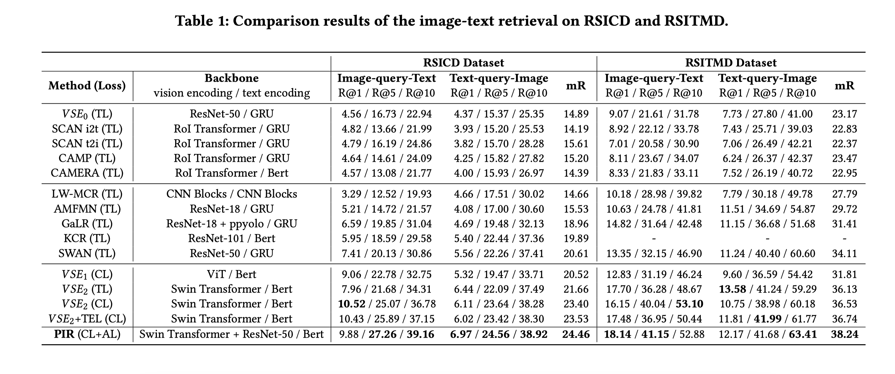

# A Prior Instruction Representation Framework for Remote Sensing Image-text Retrieval (MM'23 Oral)

By [Jiancheng Pan](https://scholar.google.com/citations?user=nRPD3tAAAAAJ&hl=en&oi=ao), Qing Ma, [Cong Bai](https://scholar.google.com/citations?hl=zh-CN&user=XGZ4UZgAAAAJ&view_op=list_works&sortby=pubdate).

This repo is the official implementation of "[A Prior Instruction Representation Framework for Remote Sensing Image-text Retrieval](https://dl.acm.org/doi/abs/10.1145/3591106.3592236)"(MM'23 Oral).
	
[](https://paperswithcode.com/sota/cross-modal-retrieval-on-rsicd?p=a-prior-instruction-representation-framework)
[](https://paperswithcode.com/sota/cross-modal-retrieval-on-rsitmd?p=a-prior-instruction-representation-framework)

## ℹ️ Introduction

This paper presents a prior instruction representation framework (PIR) for remote sensing image-text retrieval, aimed at remote sensing vision-language understanding tasks to solve the semantic noise problem. Our highlight is the proposal of a paradigm that draws on prior knowledge to instruct adaptive learning of vision and text representations. Concretely, two progressive attention encoder (PAE) structures, Spatial-PAE and Temporal-PAE, are proposed to perform long-range dependency modeling to enhance key feature representation. In vision representation, Vision Instruction Representation (VIR) based on Spatial-PAE exploits the prior-guided knowledge of the remote sensing scene recognition by building a belief matrix to select key features for reducing the impact of semantic noise. In text representation, Language Cycle Attention (LCA) based on Temporal-PAE uses the previous time step to cyclically activate the current time step to enhance text representation capability. A cluster-wise affiliation loss is proposed to constrain the inter-classes and to reduce the semantic confusion zones in the common subspace. Comprehensive experiments demonstrate that using prior knowledge instruction could enhance vision and text representations and could outperform the state-of-the-art methods on two benchmark datasets, RSICD and RSITMD.


## 🎯 Implementation
### Project Files
The directory hierarchy is shown below, where the **checkpoints** and **data** files can be downloaded from here [[Baidu Disk]](https://pan.baidu.com/s/1aB-aSfD5h_PS6Ak_tt5RGA?pwd=tqv2) .

```
.
├── checkpoints
│   └── PIR
│       ├── full_rsicd
│       │   ├── checkpoint_49.pth
│       │   ├── checkpoint_best.pth
│       │   ├── config.yaml
│       │   └── log.txt
│       └── full_rsitmd
│           ├── checkpoint_49.pth
│           ├── checkpoint_best.pth
│           ├── config.yaml
│           └── log.txt
├── configs
│   ├── config_bert.json
│   ├── config_swinT_224.json
│   ├── Retrieval_rsicd.yaml
│   └── Retrieval_rsitmd.yaml
├── data
├── dataset
├── models
├── utils
├── mytools.py
├── optim.py
├── Pretrain.py
├── Retrieval.py
├── run.py
├── scheduler.py
└── requirements.txt
```
### Environments

```bash
pip install -r requirements.txt
```

### Train
If you encounter environmental problems, you can directly modify the `get_dist_launch` function of `run.py`, for example:(2 card GPU)
```
elif args.dist == 'f2':
    return "CUDA_VISIBLE_DEVICES=0,1 WORLD_SIZE=2 /home/pjc/.conda/envs/xlvm/bin/python -W ignore -m torch.distributed.launch --master_port 9999 --nproc_per_node=2 " \
            "--nnodes=1 "
```
For training, run cmd as follow:
```bash
python run.py --task 'itr_rsitmd' --dist "f2" --config 'configs/Retrieval_rsitmd.yaml' --output_dir './checkpoints/PIR/full_rsitmd'

python run.py --task 'itr_rsicd' --dist "f2" --config 'configs/Retrieval_rsicd.yaml' --output_dir './checkpoints/PIR/full_rsicd'
```

### Test

```bash
python run.py --task 'itr_rsitmd' --dist "f2" --config 'configs/Retrieval_rsitmd.yaml' --output_dir './checkpoints/PIR/test' --checkpoint './checkpoints/PIR/full_rsitmd/checkpoint_best.pth' --evaluate

python run.py --task 'itr_rsicd' --dist "f2" --config 'configs/Retrieval_rsicd.yaml' --output_dir './checkpoints/PIR/test' --checkpoint './checkpoints/PIR/full_rsicd/checkpoint_best.pth' --evaluate
```

## 🌎 Datasets

All experiments are based on [RSITMD](https://github.com/xiaoyuan1996/AMFMN/tree/master/RSITMD) and [RSICD](https://github.com/201528014227051/RSICD_optimal) datasets.

you also can download the images form [Baidu Desk](https://pan.baidu.com/s/1mLkQA8InOxKjseGgEVoaew?pwd=c3c5), and correspondingly modify the `yaml` file under configs files as follows: `image_root: './images/datasets_name/'`


## 📊 Results



## 🙏 Acknowledgement

- Basic code to thank [X-VLM](https://github.com/zengyan-97/X-VLM) by Zeng et al.

## 📝 Citation

If you find this code useful for your work or use it in your project, please cite our paper as:

```
@inproceedings{pan2023prior,
  title={A Prior Instruction Representation Framework for Remote Sensing Image-text Retrieval},
  author={Pan, Jiancheng and Ma, Qing and Bai, Cong},
  booktitle={Proceedings of the 31st ACM International Conference on Multimedia},
  pages={611--620},
  year={2023}
}
```


