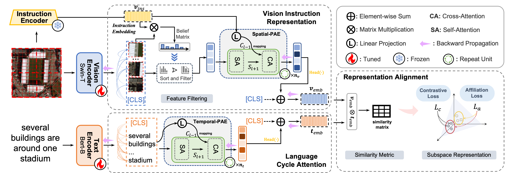

## A Prior Instruction Representation Framework for Remote Sensing Image-text Retrieval

 [A Prior Instruction Representation Framework for Remote Sensing Image-text Retrieval](). **Jiancheng Pan**, Qing Ma, Cong Bai*. ACM MM 2023.


Basic code to thank [[X-VLM]](https://github.com/zengyan-97/X-VLM) by Zeng et al.

## Introduction

This paper presents a prior instruction representation framework (PIR) for remote sensing image-text retrieval, aimed at remote sensing vision-language understanding tasks to solve the semantic noise problem. Our highlight is the proposal of a paradigm that draws on prior knowledge to instruct adaptive learning of vision and text representations. Concretely, two progressive attention encoder (PAE) structures, Spatial-PAE and Temporal-PAE, are proposed to perform long-range dependency modeling to enhance key feature representation. In vision representation, Vision Instruction Representation (VIR) based on Spatial-PAE exploits the prior-guided knowledge of the remote sensing scene recognition by building a belief matrix to select key features for reducing the impact of semantic noise. In text representation, Language Cycle Attention (LCA) based on Temporal-PAE uses the previous time step to cyclically activate the current time step to enhance text representation capability. A cluster-wise affiliation loss is proposed to constrain the inter-classes and to reduce the semantic confusion zones in the common subspace. Comprehensive experiments demonstrate that using prior knowledge instruction could enhance vision and text representations and could outperform the state-of-the-art methods on two benchmark datasets, RSICD and RSITMD. Codes are available at https://github.com/Zjut-MultimediaPlus/PIR-pytorch.




## Implementation

**Install**

```bash
pip install -r requirements.txt
```

**Train**

```bash
python run.py --task 'itr_rsitmd' --dist "f2" --config 'configs/Retrieval_rsitmd.yaml' --output_dir './checkpoints/PIR/full_rsitmd'

python run.py --task 'itr_rsicd' --dist "f2" --config 'configs/Retrieval_rsicd.yaml' --output_dir './checkpoints/PIR/full_rsicd'
```

**Test**

```bash
python run.py --task 'itr_rsitmd' --dist "f2" --config 'configs/Retrieval_rsitmd.yaml' --output_dir './checkpoints/PIR/test' --checkpoint './checkpoints/PIR/full_rsitmd/checkpoint_best.pth' --evaluate

python run.py --task 'itr_rsicd' --dist "f2" --config 'configs/Retrieval_rsicd.yaml' --output_dir './checkpoints/PIR/test' --checkpoint './checkpoints/PIR/full_rsicd/checkpoint_best.pth' --evaluate
```

## Datasets

All experiments are based on [RSITMD](https://github.com/xiaoyuan1996/AMFMN/tree/master/RSITMD) and [RSICD](https://github.com/201528014227051/RSICD_optimal) datasets.

## Results


## Citation

If you find this code useful for your work or use it in your project, please consider citing:

```
--waiting--
```